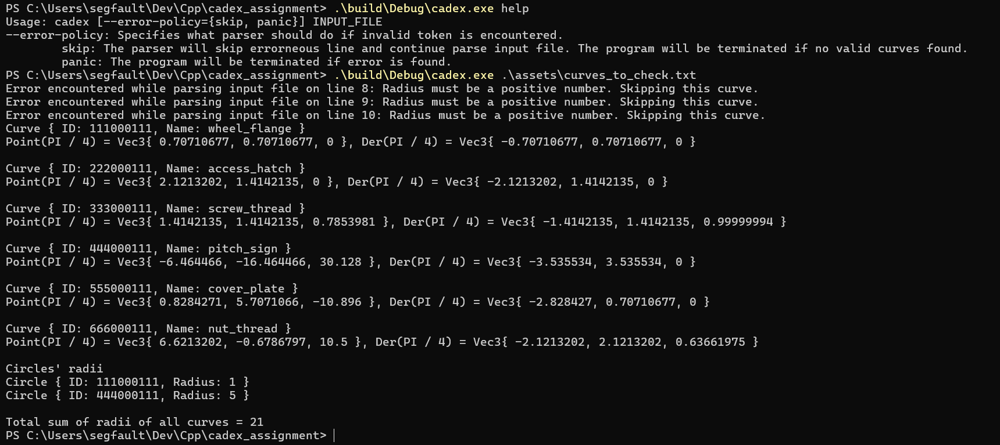

## Requirements
- C++23 compatible compiler
- CMake 4.0 and higher

This project is tested and compiled with:
- Clang 21.1.6 (Linux)
- Clang 20.1.8 (Windows)
- GCC 15.2.1 (Linux)
- MSVC 19.38 (Windows)

## Results
